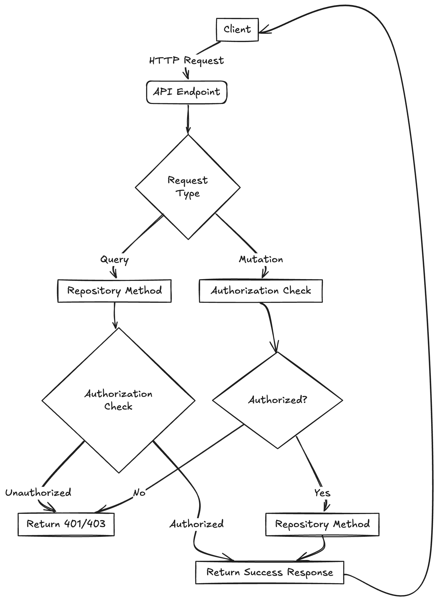

Managing resource-level access in applications is challenging, especially when you need to restrict data access without compromising performance or security.

## The Problem: Granular Resource Access

Imagine building an application where:

- **Users** need restricted access to specific resources.
- You must ensure **unauthorized data is neither returned nor mutated**.
- **Stateless JWTs** handle authentication and authorization.

While tools like **CASL** (a powerful authorization library) simplify permission handling, implementing conditional rules (e.g., access restrictions based on an organization or a resource property) can complicate things. This challenge amplifies when these rules depend on data fetched from or saved to the database.

## The Solution: Using the Decorator Pattern for Authorization

The **Decorator Pattern** offers a clean way to centralize authorization checks within database interaction methods. By applying decorators to repository methods, you ensure:

- Unauthorized operations are blocked before database queries execute.
- Data consistency and security are upheld without cluttering your codebase.

Let's dive into the **NestJS** implementation.

---

## Tech Stack

1. **Framework:** [NestJS](https://docs.nestjs.com/)
2. **Authorization Library:** [CASL](https://casl.js.org/v6/en/)
3. **Database:** [PostgreSQL](https://www.postgresql.org/)

---

## The Flow: Request Lifecycle in NestJS

I’m using NestJS in this example but this technique will work in other frameworks as well with little tweaks.

The basic request lifecycle of a NestJS app is as follows


When a request is made, **Guards** in NestJS handle both **Authentication** and **Authorization**:

1. **Authentication Guard** verifies the **JWT** token and attaches user details to the request.
2. **Authorization Guard** validates the user’s permissions against route-specific policies.

### Example: Authentication Guard

Here’s how the **AuthGuard** extracts and verifies a JWT:

```tsx
@Injectable()
export class AuthGuard implements CanActivate {
    constructor(private jwtService: JwtService) {}

    async canActivate(context: ExecutionContext): Promise<boolean> {
        const request = context.switchToHttp().getRequest();
        const token = this.extractTokenFromHeader(request);

        if (!token) {
            throw new UnauthorizedException();
        }

        try {
            const payload = await this.jwtService.verifyAsync(token, {
                secret: jwtConstants.secret,
            });
            request['user'] = payload;
        } catch {
            throw new UnauthorizedException();
        }

        return true;
    }

    private extractTokenFromHeader(request: Request): string | undefined {
        const [type, token] = request.headers.authorization?.split(' ') ?? [];
        return type === 'Bearer' ? token : undefined;
    }
}
```

### Example: Authorization Guard

The **Authorization Guard** uses **CASL** to ensure users can access a specific route. It validates JWT permissions against predefined policies:

```tsx
@Injectable()
export class AuthorizationGuard implements CanActivate {
    constructor(private readonly reflector: Reflector) {}

    canActivate(context: ExecutionContext): boolean {
        const policies = this.reflector.get<PolicyRule[]>(
            CHECK_POLICIES_METADATA_KEY,
            context.getHandler(),
        );

        if (!policies) return true;

        const request = context.switchToHttp().getRequest();
        const user = request.user;

        if (!user) {
            throw new UnauthorizedException();
        }

        const ability = createMongoAbility<AppAbility>(user.policies);
        return policies.every((rule) => ability.can(rule.action, rule.subject));
    }
}
```

While these guards work well for basic scenarios - like checking if a user can "read" or "write" to a resource. But real-world applications often need more nuanced control. Think about these scenarios:

- You need to verify if a user has permission within a specific organization
- Access depends on the actual properties of the data being accessed
- Permissions vary based on the relationship between the user and the resource

The challenge? These checks can't happen at the beginning of the request cycle. Why? Because we first need to know what data we're dealing with - whether we're trying to fetch it from the database or save new information. This is where standard guards fall short and we need a more sophisticated approach.

---

## The Decorator Pattern to the Rescue

By decorating repository methods, we enforce authorization checks dynamically, considering both the **resource type** and **data properties**.

### The AuthorizeDbQuery Decorator

The `AuthorizeDbQuery` decorator handles different query types (“CREATE”, “READ”, “UPDATE”, or “DELETE”). It uses **CASL** to verify permissions before database interaction:

```tsx
export function AuthorizeDbQuery({ type, actions, table }: AuthorizeArgs): MethodDecorator {
    return function (
        target: Record<string, any>,
        _propertyKey: string | symbol,
        descriptor: TypedPropertyDescriptor<(...args: unknown[]) => Promise<unknown>>,
    ) {
        const originalMethod = descriptor.value;

        descriptor.value = async function (
            this: { cls: ClsService; configService: ConfigService },
            ...args: unknown[]
        ): Promise<unknown> {
            const options = args.at(-1) as Record<string, unknown>;
            const ability = options?.ability as AnyMongoAbility;

            if (!ability && !options?.skipAuthorization) {
                throw new InternalServerErrorException('No ability found in the context');
            }

            const argIndex = type === QueryType.UPDATE ? 1 : 0;
            const model = Array.isArray(args[0]) ? args[0][argIndex] : args[argIndex];

            if (
                (type === QueryType.CREATE || type === QueryType.UPDATE) &&
                model &&
                !options?.skipAuthorization
            ) {
                authorize(ability, actions, model);
            }

            const result = await originalMethod.apply(this, args);

            if (type === QueryType.READ && result && !options?.skipAuthorization) {
                authorize(ability, actions, result);
            }

            return result;
        };

        return descriptor;
    };
}

function authorize(
    ability: AnyMongoAbility,
    actions: AuthorizeArgs['actions'],
    model: unknown,
): void {
    const isAllowed = actions.every((action) => ability.can(action, model));
    if (!isAllowed) {
        throw new ForbiddenException();
    }
}
```

### How It Works

1. Decorate repository methods with `AuthorizeDbQuery`.
2. Define the query type (“READ”, “CREATE”, “UPDATE”, or “DELETE”).
3. Pass the user’s ability and check permissions against the resource or input data.

### Flow Diagram



### Benefits of the Decorator Pattern

1. **Centralized Authorization Logic:** Keeps your methods clean and consistent.
2. **Reusable Across Queries:** Works for different database operations without duplication.
3. **Seamless CASL Integration:** Leverages CASL’s dynamic rule-checking capabilities for complex conditions.
4. **Error Prevention:** Eliminates manual placement of authorization checks.

---

## Conclusion

The **Decorator Pattern** simplifies resource-level access control in NestJS applications, especially when dealing with complex, condition-based permissions. By integrating it with **CASL**, you ensure that your application remains secure, maintainable, and easy to extend.

If you found this article helpful, don’t forget to share it with your peers and team. Let’s make access control less of a headache, one decorator at a time.

Cheers! 🍻
